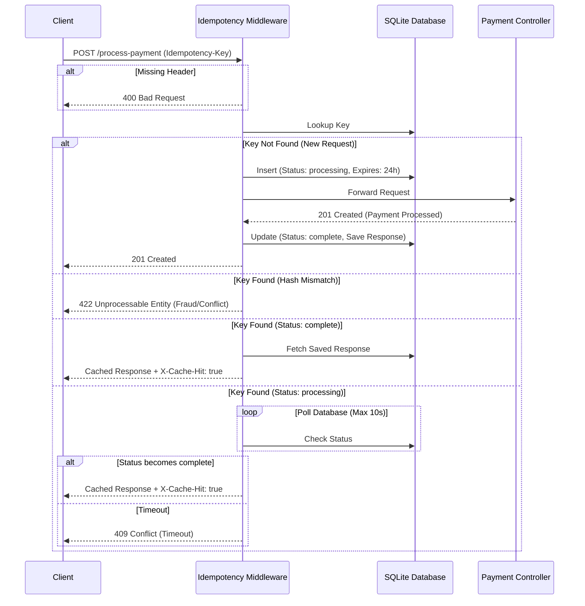

# Idempotency-Gateway

A lightweight, robust API payment middleware built with Laravel 11. This gateway ensures that no payment is processed twice—even if a client accidentally double-clicks or their network retries a dropped request. 

This project was built as a take-home assessment, demonstrating core backend concepts such as middleware, race condition handling, payload hashing, and garbage collection.

---

## Architecture Diagram

The core of this application is the `IdempotencyMiddleware`. Here is a visual representation of how a request flows through the system:



---

## Features
1. **Idempotency Guarantee**: Ensures a given `Idempotency-Key` only ever triggers the core payment logic once.
2. **Payload Fingerprinting**: Hashes the incoming request body using SHA-256. If a client attempts to reuse a key with a *different* payment amount, the request is immediately rejected.
3. **Concurrent Race Condition Handling**: If a duplicate request arrives while the first is still processing, the middleware safely waits/polls the database instead of double-charging or throwing an obscure error.
4. **Key Expiry & Garbage Collection**: Keys expire after 24 hours. A custom Artisan command (`php artisan idempotency:prune`) cleans up expired records to prevent database bloat.
5. **Beginner-Friendly Documentation**: The `/docs` folder contains step-by-step explanations of every architectural decision made during development.

---

## Setup Instructions

1. **Clone the repository**:
   ```bash
   git clone https://github.com/VargasofJVD/Idempotency-Gateway.git
   cd Idempotency-Gateway
   ```

2. **Install dependencies**:
   ```bash
   composer install
   ```

3. **Set up the environment**:
   ```bash
   cp .env.example .env
   php artisan key:generate
   ```

4. **Set up the SQLite Database**:
   Create the database file and run the migrations.
   ```bash
   # Windows (PowerShell)
   New-Item database/database.sqlite -ItemType File
   
   # Linux/Mac
   touch database/database.sqlite
   
   php artisan migrate
   ```

5. **Start the local development server**:
   ```bash
   php artisan serve
   ```

---

## 🧪 Testing the API

The API endpoint is `POST http://127.0.0.1:8000/process-payment`.

### 1. First Request (Success)
This simulates the initial payment. It will take 2 seconds to process.

**cURL:**
```bash
curl -X POST http://127.0.0.1:8000/process-payment \
-H "Content-Type: application/json" \
-H "Accept: application/json" \
-H "Idempotency-Key: my-unique-key-123" \
-d '{"amount": 100, "currency": "GHS"}'
```

### 2. Duplicate Request (Cache Hit)
Run the exact same request immediately after. It will return instantly with the cached response and an `X-Cache-Hit: true` header.

### 3. Fraud / Mismatch Request (422 Error)
Change the `amount` to `200` but keep the same `Idempotency-Key`. The middleware will catch the hash mismatch and reject it.

**cURL:**
```bash
curl -X POST http://127.0.0.1:8000/process-payment \
-H "Content-Type: application/json" \
-H "Accept: application/json" \
-H "Idempotency-Key: my-unique-key-123" \
-d '{"amount": 200, "currency": "GHS"}'
```

---

## 🏗 Design Decisions

### Why SQLite?
SQLite is beginner-friendly, requires zero configuration, and operates entirely out of a single local file. This makes it perfect for a take-home assessment where the reviewer needs to run the project instantly without spinning up Docker containers or local database servers. Because we used Laravel's Eloquent ORM, swapping to MySQL or PostgreSQL in production requires exactly zero code changes—just an update to the `.env` file.

### Why SHA-256 for Payload Hashing?
Storing raw payment data just to compare if a duplicate request matches the original is highly inefficient and creates security risks. SHA-256 is a fast, one-way hash that generates a consistent, short fingerprint of the payload. It is practically immune to collisions, making it perfect for verifying if `Request B` is perfectly identical to `Request A`.

### Why Polling for Race Conditions?
If two identical requests hit the server at the exact same millisecond, the second request might query the database *before* the first request has finished inserting the processing status, causing a race condition. In this project, if we detect an "in-flight" request, we use a `sleep()` polling loop to wait for it to finish. While a high-scale production system would use Redis Distributed Locks or Database Row Locks (`SELECT ... FOR UPDATE`), a simple polling loop is robust, easy to read, and works perfectly within the constraints of SQLite for this assessment.

### Why 24-Hour Key Expiry?
An Idempotency Key shouldn't lock an ID forever. The industry standard (used by companies like Stripe) is to expire idempotency keys after 24 hours. A network retry will happen within seconds or minutes. If a client sends the exact same key 3 weeks later, it's almost certainly a bug on their end generating duplicate UUIDs for *new* transactions. Expiring the keys allows them to safely process their new payment without us permanently blocking them.

---

## 🛠 Developer's Choice: Key Expiry & Garbage Collection

### What it is
We added a `expires_at` column to the `idempotency_records` table, automatically set to 24 hours in the future. The middleware checks this column; if the key has expired, it deletes the old record and processes the request as new. To prevent database bloat, we built a custom Artisan command (`php artisan idempotency:prune`) that acts as a Garbage Collector, wiping out expired rows.

### Why it matters for Fintech
1. **Database Performance at Scale**: Without pruning, a payment gateway processing 100,00s of transactions a day would suffer massive database bloat, slowing down index lookups and skyrocketing storage costs.
2. **PCI-DSS & Data Minimization**: Holding onto payment request data longer than necessary creates compliance liabilities. Automatically pruning data that is no longer needed for idempotency aligns with strict data minimization regulations.

---

## 🧹 Maintenance (Garbage Collection)
To delete all records older than 24 hours, run the custom console command:
```bash
php artisan idempotency:prune
```
